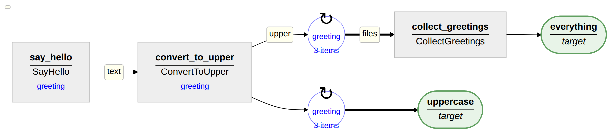

# Tutorial

In this tutorial you build a small pipeline step by step: write a greeting to a file, convert it
to upper case, and collect all greetings in one file. Along the way you see how rules are written
and connected, what the log files tell you, and what happens when a job fails.

Every step is a complete Snakefile from the folder `examples/tutorial` of the Snake++ repository,
next to the file `greetings.csv` it reads. Run a step from that folder with
`snakemake -s step1.smk -c1`; or save it as `Snakefile`, and run `snakemake -c1`.

## Installation

```
pip install snakeplusplus
```

This also installs Snakemake. Snake++ adds no command of its own for running pipelines: you run
them with `snakemake`, as usual.

## Step 1: a first rule

```python
--8<-- "examples/tutorial/step1.smk"
```

From top to bottom:

- **`pathvars`** and **`configure()`**: where the log files and the results go.
- **`SayHello`** is a rule: a class derived from `SnakeRule`.
    - `result_template = '{greeting}'` says that the rule has one wildcard, `greeting`, and that
      each job writes in its own folder, `results/<greeting>/say_hello/`. The rule name is
      added automatically.
    - The `OutputModel` lists the outputs: `text`, a file named `hello.txt` in that folder.
    - `run()` does the work of one job. `output.text` is the full path of the output file.
- **`say_hello = SayHello()`** creates the rule. Its name in the pipeline is the variable name.
- **`target(...)`** names what Snakemake should produce: `say_hello` for three greetings.
  `foreach` makes a loop over the jobs of a rule.
- **`build(locals())`** turns all this into Snakemake rules. It is always the last line.

Run it, and look at what appeared:

```
logs/Bonjour_say_hello.log
logs/Hello_say_hello.log
logs/Hola_say_hello.log
logs/everything.log
results/Bonjour/say_hello/hello.txt
results/Hello/say_hello/hello.txt
results/Hola/say_hello/hello.txt
```

Every job has exactly one log file. This is `logs/Hello_say_hello.log`:

````
"say_hello(SayHello)<greeting=Hello>" started at 2026-10-04 21:25:30, saving output to
results/Hello/say_hello/


[0:00:00] "say_hello(SayHello)<greeting=Hello>" completed in 0:00:00 (h:mm:ss).

Output mapping

```json
{
  "by_name": {
    "text": "hello.txt"
  }
}
```
````

The extension `.log` means that the job succeeded. The output mapping at the end lists what the
job produced; that is how other rules find its outputs.

Run `snakemake -c1` again: nothing happens, everything is done. Delete
`logs/Hola_say_hello.log` and run again: only that job runs, and the target that depends on it.

## Step 2: connect two rules

The next rule converts the greeting to upper case. Its input is the output of `SayHello`. And the
greetings now come from the file `greetings.csv`:

```python
--8<-- "examples/tutorial/step2.smk"
```

What is new:

- **`InputModel`** declares the inputs of `ConvertToUpper`, with their type.
- **`set_input(text=say_hello.get_output('text'))`** connects them: the input `text` of each job
  is the output `text` of the `SayHello` job with the same greeting. You never write a file name
  pattern for this.
- **`job.shell(...)`** runs a shell command; the command and its output go into the log file.
- **`foreach(greetings)`**: a loop can also take a function that yields the wildcards of each job.

Connections are checked when the Snakefile is loaded. A typo such as `get_output('txt')` stops
Snakemake before anything runs, at the line where it happens:

```
KeyError in file "step2.smk", line 48:
"SayHello has no output 'txt'"
```

The log file of a `ConvertToUpper` job now also shows the command:

````
"convert_to_upper(ConvertToUpper)<greeting=Hello>" started at 2026-10-04 21:25:32, saving output to
results/Hello/convert_to_upper/


[0:00:00] Running shell script:

```
tr '[:lower:]' '[:upper:]' < results/Hello/say_hello/hello.txt > results/Hello/convert_to_upper/upper.txt
```

[0:00:00] "convert_to_upper(ConvertToUpper)<greeting=Hello>" completed in 0:00:00 (h:mm:ss).
````

The log files are plain text, laid out as Markdown, so they also read well in a Markdown viewer.

## Step 3: collect the results

The last rule puts all greetings in one file. Two rules now run once per greeting, so they share
their `result_template` through a base class:

```python
--8<-- "examples/tutorial/step3.smk"
```

What is new:

- **`GreetingRule`**: rules that share wildcards can inherit them.
- **`CollectGreetings`** has no wildcards: it runs once. Its input `files` is a list, connected to
  a loop over all `ConvertToUpper` jobs.
- **`count: int`** is an output that is not a file. `run()` declares it with
  `output(count=...)`, and it appears in the output mapping, where other rules can read it:

    ```json
    {
      "by_name": {
        "collected": "all_greetings.txt",
        "count": 3
      }
    }
    ```

- **Two targets.** `snakemake -c1` produces the first one, `everything`;
  `snakemake -c1 uppercase` only converts the greetings.

If you ran step 2 first, only `collect_greetings` and `everything` run now. Moving the
`result_template` to a base class did not change any names, and a change in the code alone does
not make jobs run again.

## Step 4: when a job fails

To see what happens when something goes wrong, add two lines to `ConvertToUpper.run()`, and
import `JobError`:

```python
if wildcards.greeting == 'Hola':
    raise JobError('Spanish is not supported yet')
```

(This is `step4.smk`.) Run it from scratch. Snakemake does not stop at the failure: the other
greetings are converted as usual. The log folder shows what failed:

```
Bonjour_convert_to_upper.log
Bonjour_say_hello.log
Hello_convert_to_upper.log
Hello_say_hello.log
Hola_convert_to_upper.error
Hola_say_hello.log
collect_greetings.error
everything.error
```

`Hola_convert_to_upper.error` says why:

````
[0:00:00] Errors occurred:

```
Spanish is not supported yet
```
````

`collect_greetings` needs all greetings, so it did not run either, and its log points to the
cause:

````
[0:00:00] Errors occurred:

```
"collect_greetings" did not run because 1 job(s) it depends on failed:
- input 'files': logs/Hola_convert_to_upper
    Spanish is not supported yet
    (log-file: Hola_convert_to_upper.error)
```
````

Now fix the problem: remove the two lines again (or run `step3.smk`). Run Snakemake, and only the
jobs that failed run again: `convert_to_upper` for Hola, `collect_greetings` and `everything`.
Everything that succeeded is kept.

`JobError` is for errors with a clear message. Any other exception in `run()` is reported the same
way, together with the lines of your code where it happened.

## Step 5: a diagram of the pipeline

```
snakeplusplus-doc step3.smk -o pipeline.html
```

writes an HTML page with a diagram of the pipeline and, for each rule, its wildcards, inputs,
outputs and parameters. Nothing is run for this.



## Next

- [Rules](concepts/rules.md) and [Connecting rules](concepts/connecting.md) explain the building
  blocks in more detail.
- [When jobs rerun](concepts/reruns.md) explains how Snake++ decides what to run.
- [Run external commands](how-to/external-commands.md) shows how to run real tools, such as those
  of MRtrix or FSL.
